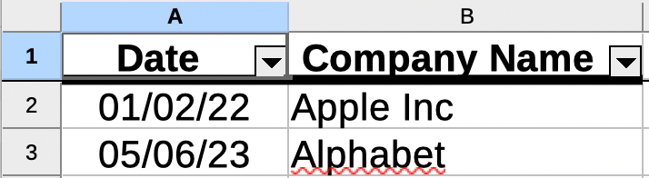

# excel-generator-poi
Excel generator using Apache POI + Hibernate


# Usage examples
## Data objects
```java
        Report report = new Report();
        report.setReportName("Test from data");

        Column column1 = new Column();
        column1.setName("Date");
        column1.setDataType(DataType.DATE);
        report.addColumn(column1);

        Column column2 = new Column();
        column2.setName("Company Name");
        column2.setDataType(DataType.COMPANY_NAME);
        report.addColumn(column2);

        List<Object> row = new ArrayList<>();
        row.add("01/02/22");
        row.add("Apple Inc");
        report.addRow(row);

        row = new ArrayList<>();
        row.add("05/06/23");
        row.add("Alphabet");
        report.addRow(row);

        String pathToReport = new ReportGenerator(report).getReport(ExportTo.EXCEL);
```
## From JSON
```java
        String jsonConfiguration = "{" +
                "  \"reportName\": \"Test from data\"," +
                "  \"columnList\": [" +
                "    {" +
                "      \"dataType\": \"DATE\"," +
                "      \"name\": \"Date\"" +
                "    }," +
                "    {" +
                "      \"dataType\": \"COMPANY_NAME\"," +
                "      \"name\": \"Company Name\"" +
                "    }" +
                "  ]" +
                "}";

        Report report = ReportGeneratorUtility.fromJson(jsonConfiguration);
        List<Object> row = new ArrayList<>();
        row.add("01/02/22");
        row.add("Apple Inc");
        report.addRow(row);

        row = new ArrayList<>();
        row.add("05/06/23");
        row.add("Alphabet");
        report.addRow(row);

        String pathToReport = new ReportGenerator(report).getReport(ExportTo.EXCEL);
```

## From database
```java
        String jsonConfiguration = "{" +
                "  \"reportName\": \"Test from data\"," +
                "  \"columnList\": [" +
                "    {" +
                "      \"dataType\": \"DATE\"," +
                "      \"name\": \"Date\"," +
                "      \"sqlColumnName\": \"COMPANY_DATE\"" +
                "    }," +
                "    {" +
                "      \"dataType\": \"COMPANY_NAME\"," +
                "      \"name\": \"Company Name\"," +
                "      \"sqlColumnName\": \"COMPANY_NAME\"" +
                "    }" +
                "  ]" +
                "}";

        Report report = ReportGeneratorUtility.fromJson(jsonConfiguration);
        String sql = "select company_date, COMPANY_NAME from company $P!{P_FILTER} ";
        
        Map<String, Object> parameters = new HashMap<>();
        parameters.put("name","ALPHABET");

        String filterSQL = "where upper(COMPANY_NAME) like '%:name%'";
        sql = sql.replace("$P!{P_FILTER}",filterSQL);
        report.setSql(sql);
        report.setParameters(parameters);
        report.setEm(em);

        String pathToReport = new ReportGenerator(report).getReport(ExportTo.EXCEL);
```